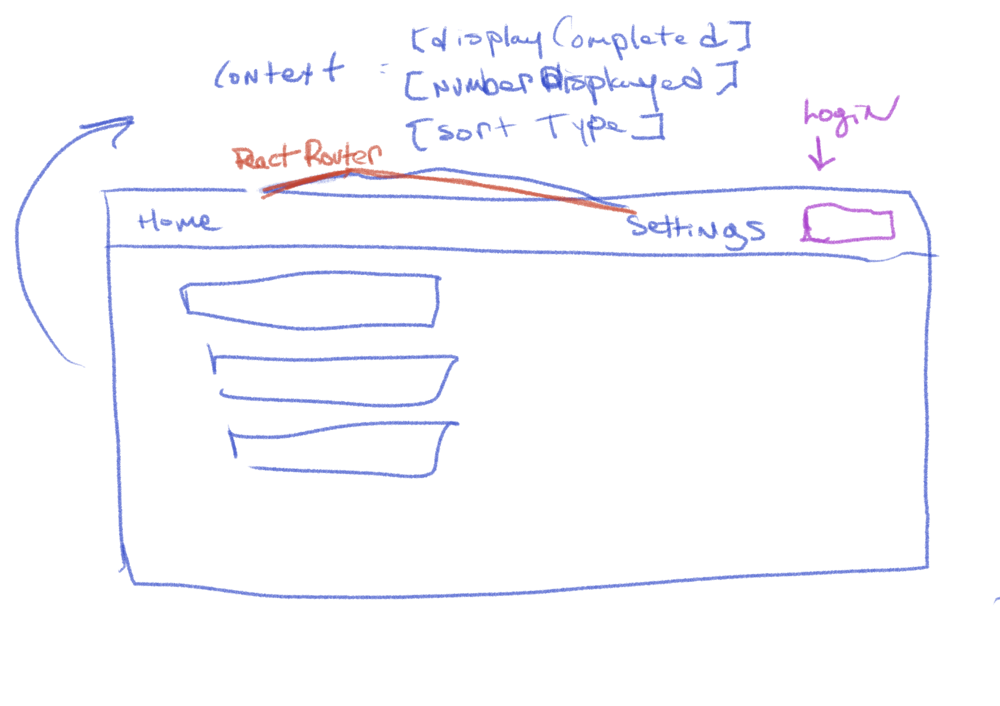
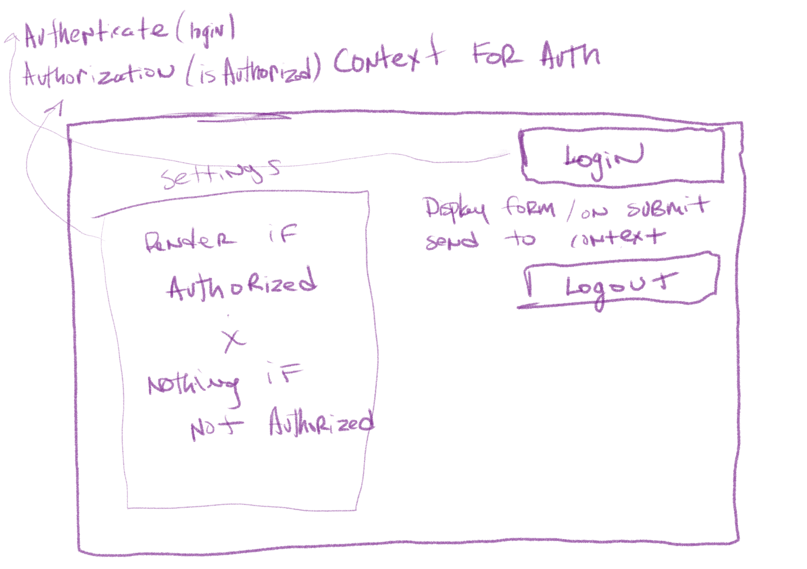
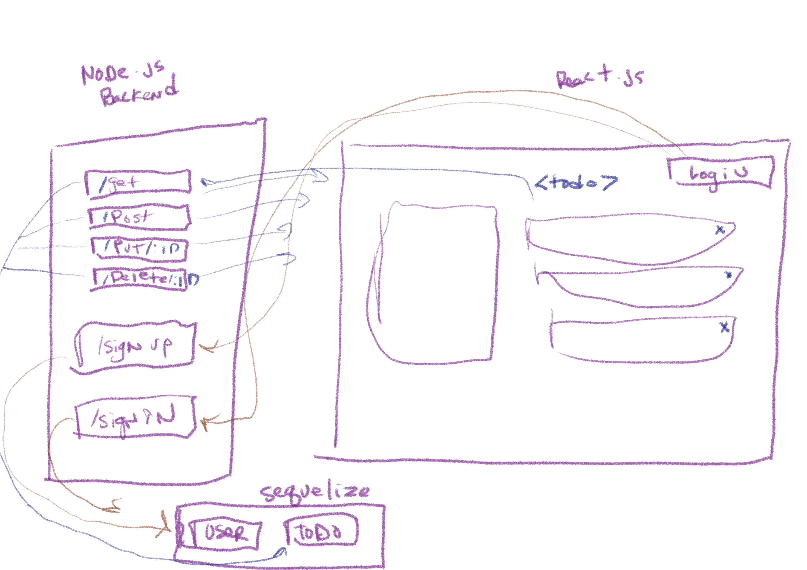

# todo
# Lab - Class 31

## Author: Tek Jones

## Deployment and test
  * [test report]()
  * [deployment lab31](https://codesandbox.io/s/confident-nightingale-irutc)
  * [deployment lab32](https://codesandbox.io/s/gallant-taussig-x0cup)
  * [deployment lab33](https://codesandbox.io/s/crazy-wildflower-dkcps)
  * [deployment lab34](https://codesandbox.io/s/laughing-murdock-fwil5)
  * [deployment lab34 backend](https://todo-backend34.herokuapp.com/)

## About
- To do list manager
- A Web Application for securely managing a To Do List

## Setup

## Running the app
  * npm start

## Test
* npm test

### Phase 1
- our goal is to setup a foundational system using React hooks that we can build upon in later phases, adding databases, logins, and more advanced features.

### User Stories
- As a user, I would like an easy way to add a new to do item using an online interface
- As a user, I would like my to do items to have an assignee, due date, difficulty meter, status and the task itself
- As a user, I would like to delete to do items that are no longer needed
- As a user, I would like to easily mark to do items as completed
- As a user, I would like to edit an existing to do item

### Technical Requirements
- Convert the architecture from Class Based Components into Functional Components
- Apply styling and layout using React Bootstrap Components
- Ensure the current functionality works unchanged
- Manage state using the useState() hook
- Use a useEffect() hook to change the title of the browser with the complete/incomplete counts
- Use a useEffect() hook to pre-load the seeded To Do Items
- Match the provided mockup for the design
   - Use react-bootstrap components and theming
   - Some interactivity notes:
     - Each item in list should show the text of the item as well as the assignee
     - When clicked, toggle the “complete” status of the item.
     - Items should be styled differently when complete/incomplete making their status visually obvious

## UML

---

### Phase 2
- we're going to extend the functionality of our application by allowing the user to make some decisions on how they would like the application to function. Specifically, we'll let them make changes to 2 settings.

### User Stories
- As a user I would like to have global settings for changing how many to do Items to display at once
- As a user, I would like to be able to show or not show completed items

### Technical Requirements

Based on global configuration

  - Show a maximum of a certain number of items per screen in the <List /> component
      - Provide "next" and "previous" links to let the users navigate a long list of items
  - Hide or show completed items in the list
  - Optional: Sort the items based on any of the keys (i.e. difficulty)

Implement this using context

  - Create a context for managing application settings and provide this at the application level
  - Display or Hide completed items (boolean)
  - Number of items to display per screen (number)
  - Default sort field (string)
  - Create a function in your context that saves user preferences (for the above) to local storage
  - Implement a useEffect() (or componentDidMount()) in your context to read from local storage and set the values for those 2 state properties on application load

Pagination Notes

  - Only display the first n items in the list, where n is the number to display per screen in your context.
    - If you have more than n items in the list, add a button labeled Next that will replace the list with the next n items in the list.
    - If you are past the first n items (i.e. on page 2 or higher), add a button labeled Previous that will replace the list with the previous n items in the list.

## UML

### Phase 3
- Extend the functionality of the application by requiring users be logged in to view items and also restrict access based on user type. The user stories from Phases 1, and 2 remain unchanged. For this phase, we are now adding the following new user stories.

### User Stories
- As a user, I want to provide a way for other users to create new accounts
- As a user, I want to provide a way for all users to login to their account
- As a user, I want to make sure that my To Do items are only viewable to users that have logged in with a valid account.
- As a user, I want to ensure that only fellow users that are allowed to "create", based on their user type, can add new To Do Items
- As a user, I want to ensure that only fellow users that are allowed to "update", based on their user type, can mark To Do Items complete
- As a user, I want to ensure that only fellow users that are allowed to "delete", based on their user type, can delete new To Do Items

### Technical Requirements

- Provide an account login screen
   - Accepts Username and Password
   - On successful login, store the token as a cookie
- If a user returns and has a valid login cookie, bypass the login screen and consider them "Logged In"

Using Login/Auth Context, "protect" the To Do application by restricting access to the various application features based on the users' login status and capabilities.

- Implement <Login /> and <Auth /> components with Context
- Link to the Login screen in your main menu
   - Hide the entire interface until the user has logged in.
   - Implement the following RBAC rules:
     - Logged In Users with 'read' permissions can see the summary/count
     - Logged In Users with 'read' permissions can see the list of To Do Items
     - Logged In Users with 'update' permissions can click the records to mark them as complete
     - Logged In Users with 'create' permissions can create new items
     - Logged In Users with 'delete' permissions can delete items

## UML

### Phase 4
- We will finalize the functionality of the application by connecting to live servers for login, authorization, and data access

### Technical Requirements
- Alter the Add, Toggle Complete, and Delete functions within your to do application to use your API instead of in memory state

    - Fetch the current list of items from the database on application start
    - Whenever you add/update/delete an item, refresh the state so the user can instantly see the change
        - Consider: Do you re-fetch from the server every time you make a change?
          -  If so, how?
          -  If not, how will you stay in sync?
- Alter the Login Context to use the server to login users instead of our mock users list

    - Be sure to store the token in state as well as in a cookie so you can reference it later

## UML

