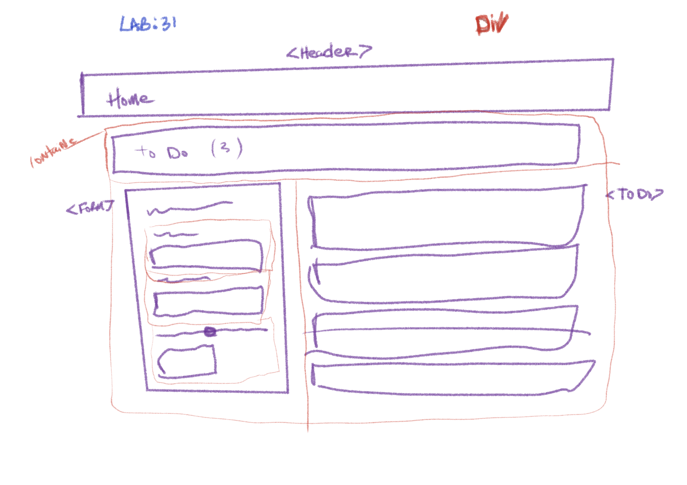

# todo
# Lab - Class 31

## Author: Tek Jones
  * [test report]()
  * [deployment lab31](https://codesandbox.io/s/confident-nightingale-irutc)

## About
- To do list manager
- A Web Application for securely managing a To Do List

## Setup

## Running the app
  * npm start

## Test
* npm test

### Phase 1
- our goal is to setup a foundational system using React hooks that we can build upon in later phases, adding databases, logins, and more advanced features.

### User Stories
- As a user, I would like an easy way to add a new to do item using an online interface
- As a user, I would like my to do items to have an assignee, due date, difficulty meter, status and the task itself
- As a user, I would like to delete to do items that are no longer needed
- As a user, I would like to easily mark to do items as completed
- As a user, I would like to edit an existing to do item

### Technical Requirements
- Convert the architecture from Class Based Components into Functional Components
- Apply styling and layout using React Bootstrap Components
- Ensure the current functionality works unchanged
- Manage state using the useState() hook
- Use a useEffect() hook to change the title of the browser with the complete/incomplete counts
- Use a useEffect() hook to pre-load the seeded To Do Items
- Match the provided mockup for the design
   - Use react-bootstrap components and theming
   - Some interactivity notes:
     - Each item in list should show the text of the item as well as the assignee
     - When clicked, toggle the “complete” status of the item.
     - Items should be styled differently when complete/incomplete making their status visually obvious

## UML

